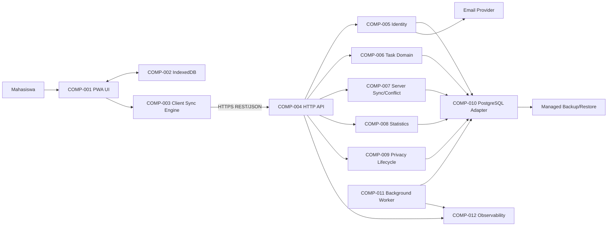

# Architecture Design — To-Do App Mahasiswa

Status: Architecture baseline untuk database/API/UI design
Tanggal: 29 Juni 2026
Input: `03-specification.md` (`DOC-003`) dan `05-validation-change.md` (`DOC-005`)
Readiness: `DEC-023`, `DEC-024`; release gates tetap mengikuti `DEC-025`

## 1. Architecture Drivers and Assumptions

- Scope functional: REQ-001–REQ-008, REQ-013, REQ-015, REQ-017, REQ-018, REQ-022, REQ-024, REQ-025.
- Quality: NFR-001–NFR-008, NFR-010, NFR-011.
- Delivery baseline: satu developer, 12 minggu, biaya rendah, web responsif/PWA, stack TypeScript (`CON-004`, `DEC-011`).
- Scale awal: hingga 1.000 task per akun, trafik mahasiswa skala MVP, satu region; scale-out hanya setelah evidence.
- Android native, collaboration, export, recurring, reminder, tag, subtasks, dan kanban bukan bagian deployable MVP.

## 2. Architecture Style

Dipilih **client-server modular monolith dengan PWA local-first**.

- Client PWA menangani UI, cache aplikasi, IndexedDB, dan offline command queue.
- Satu backend deployable memisahkan modul identity, task, sync, statistics, privacy, dan operations melalui boundary internal.
- PostgreSQL menjadi authoritative server store; IndexedDB menjadi device-local replica/cache, bukan sumber kebenaran global.
- Komunikasi client-server memakai HTTPS REST/JSON dengan idempotency key dan entity version.
- Worker dalam deployable yang sama atau process terpisah dari codebase yang sama menangani purge terjadwal dan account deletion.

Arsitektur ini lebih sederhana dioperasikan daripada microservices, tetapi tetap memberi module boundary agar bagian berisiko dapat dipisah bila scale atau tim bertambah.

## 3. Components

| Component | Responsibility | Depends On | Owner/Boundary | Traceability |
|---|---|---|---|---|
| COMP-001 PWA UI | Responsive screens, accessible interaction, auth/task/calendar/statistics states | COMP-002/003/004 | Untrusted client; presentation boundary | REQ-001–007/013/015/022/024/025; NFR-001/008 |
| COMP-002 Local Data Store | IndexedDB task replica, command queue, sync metadata, session-safe cache | Browser storage | Device-local; encrypt/minimize sensitive cache where feasible | REQ-008/017; NFR-003/004 |
| COMP-003 Client Sync Engine | Queue commands, generate idempotency keys, reconnect, retry with backoff, expose pending/conflict state | COMP-002/004 | Client application boundary | REQ-017/018; AC-019–021; NFR-004/005 |
| COMP-004 HTTP API | Validate requests, authenticate, authorize resource access, map errors, rate limit | COMP-005–009/012 | Public server boundary | REQ-015; NFR-006/007 |
| COMP-005 Identity | Registration, login/logout, password reset, sessions/tokens, account state | COMP-010, email provider | Authentication boundary | REQ-015/024; AC-016/017/027; NFR-006 |
| COMP-006 Task Domain | Task invariants, CRUD, status, priority, due time, trash/restore, calendar query | COMP-010 | Domain boundary; no direct UI/storage coupling | REQ-001–008/013/022; NFR-003 |
| COMP-007 Server Sync/Conflict | Idempotent command handling, version checks, conflict records, acknowledgement | COMP-006/010 | Consistency boundary | REQ-017/018; NFR-004/005 |
| COMP-008 Statistics | Record completion events and count distinct task per period | COMP-006/010 | Read-model boundary | REQ-025; AC-028 |
| COMP-009 Privacy Lifecycle | Data summary, schedule/cancel account deletion, retention policy | COMP-005/006/010/011 | Privacy boundary | REQ-024; NFR-007 |
| COMP-010 PostgreSQL Adapter | Transactions, repositories, migrations, tenant scoping, optimistic version | PostgreSQL | Authoritative persistence boundary | REQ-008/015/018/024; NFR-003/006/010 |
| COMP-011 Background Worker | Purge expired trash, execute expired account deletion, retry operational jobs | COMP-009/010/012 | Privileged asynchronous boundary | REQ-005/024; NFR-007/010 |
| COMP-012 Observability | Structured logs, request/job correlation, metrics, audit events, alerts | All server components | Operations boundary; no task content in normal logs | NFR-005/006/010/011; VAL-018/019 |

## 4. Module and Data Ownership Rules

- Identity owns user, credential/session, password-reset token, and account lifecycle state.
- Task Domain owns task state; other modules access it through domain services/repositories, not table coupling.
- Sync owns idempotency records, device cursor, entity version comparison, and conflict records.
- Statistics owns immutable completion events/read calculations; it does not mutate task state.
- Privacy Lifecycle coordinates account deletion but calls module-owned deletion/anonymization operations.
- Every server query is scoped by authenticated `user_id`; client-provided ownership values are ignored.
- Database transactions protect a single command. Cross-module background work uses durable jobs and idempotent handlers.

## 5. Critical Data Flows

### 5.1 Authentication

1. COMP-001 submits credentials over TLS to COMP-004.
2. COMP-005 validates input, hashes passwords with an adaptive algorithm, and establishes a secure session.
3. COMP-004 derives `user_id` from the authenticated session for every private request.
4. Password reset uses a short-lived, single-use token delivered through the email provider.

### 5.2 Online Task Command

1. COMP-001 writes an optimistic local change and command to COMP-002.
2. COMP-003 sends command ID, entity ID, base version, and payload to COMP-004.
3. COMP-004 authenticates/authorizes; COMP-007 checks idempotency and version.
4. COMP-006 validates domain rules and COMP-010 commits task plus acknowledgement atomically.
5. COMP-003 applies the canonical response and clears pending state.

### 5.3 Offline and Reconnect

1. Offline commands remain durable in IndexedDB across reload/restart.
2. UI always distinguishes `synced`, `pending`, `failed`, and `conflict`.
3. On reconnect, COMP-003 sends commands in dependency order with exponential backoff.
4. Duplicate command IDs return the original result without applying twice.
5. Version mismatch creates a conflict record retaining local and server versions; the UI asks the user to choose/merge.
6. Conflict resolution becomes a new versioned command and is audited without logging task content.

### 5.4 Delete, Restore, and Account Deletion

1. Task delete sets `deleted_at`; restore clears it if age <30 days.
2. Permanent task deletion requires a separate confirmation and privileged domain command.
3. COMP-011 purges expired trash idempotently.
4. Account deletion sets `scheduled_deletion_at = now + 30 days`, invalidates new long-lived sessions as policy requires, and remains cancellable before expiry.
5. After expiry, COMP-011 deletes/anonymizes module-owned data and records a non-sensitive audit result.

### 5.5 Calendar and Statistics

- Due input is interpreted in the profile timezone (23:59 when time is omitted), stored as UTC plus timezone context, and projected to local calendar dates on read.
- Completing a task appends a completion event. Statistics count distinct `task_id` within the requested period.

## 6. External Integrations

| Integration | Purpose | Data Shared | Failure Behavior | Exit Strategy |
|---|---|---|---|---|
| Email provider | Password reset and security notification | Email address, template metadata, one-time link | Queue/retry; generic UI response prevents account enumeration | Provider adapter permits replacement |
| Managed PostgreSQL/backup | Authoritative storage and point-in-time/periodic backup | Application data | App enters degraded/read-only response as appropriate; alert operator | Standard PostgreSQL dump/restore and migrations |
| Hosting/CDN/TLS | Serve PWA and backend securely | HTTP traffic and operational metadata | Health checks, rollback previous image/static asset | Container/static artifacts remain portable |

No calendar, LMS, push notification, analytics advertising, or collaboration integration is included in MVP.

## 7. Deployment Shape

| Unit | Shape | Scaling/Availability | Security |
|---|---|---|---|
| PWA | Versioned static assets behind CDN/HTTPS | Cache immutable assets; service worker upgrade strategy | CSP, integrity where supported, no embedded secrets |
| Backend | One stateless container/process for API; optional worker process from same codebase | Start single instance; horizontal scale only after metrics | TLS termination, secrets manager/env injection, least privilege |
| Worker | Same deployment package, separate command/process | One active scheduler or database-backed job locking | Separate DB role where practical |
| PostgreSQL | Managed single primary with backups | Scale vertically first; connection pooling | Private network, encrypted transport/storage, restricted roles |
| Observability | Hosted or self-managed logs/metrics | Retention based on cost/privacy | Redaction; no password/token/task body |

CI must run lint, type checking, unit/integration tests, migration checks, and security configuration checks before producing immutable artifacts. Deployment uses backward-compatible expand/migrate/contract changes and can roll back application binaries independently of destructive migrations.

## 8. Architecture Decision Records

### ADR-001: Modular monolith for MVP

- Context: Solo developer/12 weeks with tightly related identity, task, sync, and privacy flows (`CON-004`, NFR-011).
- Decision: One backend deployable with enforced internal modules.
- Options considered: microservices, serverless functions, unstructured monolith.
- Consequences/tradeoffs: Lowest operational overhead; module discipline is required to avoid coupling.
- Rollback/migration: Extract a module only after measured scaling/team pressure; stable API and ownership boundaries reduce extraction cost.

### ADR-002: Responsive PWA with IndexedDB local replica

- Context: Web-first plus offline requirement (`DEC-011/012`, REQ-017, NFR-004).
- Decision: PWA app shell, IndexedDB for task replica/queue, service worker for static assets.
- Options considered: online-only SPA, Android-first, full local-only app.
- Consequences/tradeoffs: One codebase and useful offline behavior; browser storage limits and service-worker upgrades require testing.
- Rollback/migration: Disable offline writes behind a capability flag while retaining online read/write if sync proves unsafe; never discard queued user data.

### ADR-003: HTTPS REST/JSON contract

- Context: One PWA now and Android later (`REQ-016` deferred).
- Decision: Versioned resource/command endpoints using JSON, explicit error codes, idempotency key, and entity version.
- Options considered: GraphQL, RPC-only, direct backend-as-a-service access.
- Consequences/tradeoffs: Easy testing and future Android use; some purpose-built sync endpoints are still needed.
- Rollback/migration: Additive API evolution; deprecate fields/endpoints only after client telemetry confirms migration.

### ADR-004: PostgreSQL as authoritative store

- Context: Transactions, ownership, retention, conflicts, and backup are critical (`NFR-003/006/010`).
- Decision: PostgreSQL with migrations, foreign keys, indexes, row version, soft-delete timestamps, and tenant-scoped repositories.
- Options considered: document database, browser-only storage, multiple databases.
- Consequences/tradeoffs: Strong consistency and mature backup; schema migrations need discipline.
- Rollback/migration: Expand/migrate/contract migrations; take verified backup before risky schema changes.

### ADR-005: Idempotent optimistic concurrency with retained conflicts

- Context: Offline writes and multiple devices must not silently overwrite (`REQ-018`, NFR-005, VAL-019).
- Decision: UUID command ID, base entity version, atomic idempotency record, server version increment, explicit conflict artifact retaining both versions.
- Options considered: last-write-wins, pessimistic locks, CRDT for all task fields.
- Consequences/tradeoffs: Prevents silent loss and is understandable; conflict UI/data add complexity.
- Rollback/migration: Capability flag may pause offline mutation; queued commands and conflict payloads remain exportable/recoverable.

### ADR-006: Thirty-day soft-delete lifecycle

- Context: REQ-005/022/024 require safe deletion and privacy control (`DEC-016`).
- Decision: Task trash and account deletion grace are 30 days; purge is asynchronous and idempotent.
- Options considered: immediate hard-delete, indefinite trash, provider-only recovery.
- Consequences/tradeoffs: Recoverability versus retained-data/privacy cost.
- Rollback/migration: Retention duration is policy configuration; shortening it requires explicit stakeholder review and user notice.

### ADR-007: Server-enforced identity and resource authorization

- Context: Private academic data and account isolation (`REQ-015`, NFR-006/007).
- Decision: Secure server session/token, adaptive password hash, TLS, generic auth errors, server-derived ownership checks.
- Options considered: client-only identity, public identifiers as authorization, custom cryptography.
- Consequences/tradeoffs: Clear trust boundary; session/recovery security requires operational care.
- Rollback/migration: Identity provider adapter allows migration; dual-validation period can support token/session transition.

### ADR-008: UTC instant plus profile timezone

- Context: Calendar correctness and future multi-device use (`REQ-007/013`, CONF-004).
- Decision: Store due instant in UTC and timezone context; render/group using profile timezone.
- Options considered: naive local timestamp, date-only everywhere.
- Consequences/tradeoffs: Predictable cross-device behavior; timezone change semantics require explicit UI.
- Rollback/migration: Preserve original local input/timezone fields so projections can be recalculated.

### ADR-009: Portable low-cost deployment with managed database

- Context: Solo developer, low budget, NFR-010.
- Decision: Static PWA, containerized backend/worker, managed PostgreSQL with automated backup.
- Options considered: Kubernetes, fully bespoke servers, provider-coupled functions.
- Consequences/tradeoffs: Low operations burden and reasonable portability; provider limits must be monitored.
- Rollback/migration: Immutable previous image/static release plus PostgreSQL export enables provider move; destructive DB rollback is avoided.

### ADR-010: Privacy-safe observability

- Context: Sync/debugging and deletion jobs require evidence without leaking task content (`VAL-018/019`, NFR-006/010/011).
- Decision: Correlation IDs, command IDs, result/status, latency, version, and job metrics; redact credentials, tokens, email where unnecessary, and task text.
- Options considered: verbose payload logging, minimal error-only logs.
- Consequences/tradeoffs: Useful diagnostics with lower privacy risk; some content-related bugs need user-provided reproduction.
- Rollback/migration: Logging level can be reduced immediately; retention can be shortened without application migration.

## 9. Security, Integrity, and Operations Controls

- Threat boundary: browser/device is untrusted; every server request is authenticated, authorized, validated, and rate-limited as appropriate.
- Data integrity: foreign keys, unique idempotency keys, optimistic version, transaction boundaries, and durable jobs.
- Secret handling: no secrets in client bundle/repo/logs; rotate server/provider credentials.
- Web controls: CSP, secure/HttpOnly/SameSite cookies when cookie sessions are used, CSRF defense, input/output encoding, dependency scanning.
- Privacy: collect minimum fields, provide data summary/account deletion, redact logs, document retention.
- Backup: automated daily backup plus scheduled restore drill; backup success alone does not satisfy NFR-010.
- Observability: sync conflict rate, queue age, command failure, auth failure rate, purge backlog, backup/restore evidence.

## 10. Risks

| Risk | Impact | Mitigation | Owner/Trigger |
|---|---|---|---|
| Offline queue corruption/browser eviction | Pending user changes lost | Transactional IndexedDB writes, queue health check, recovery/export diagnostic, integration tests | STK-003; any data-loss defect |
| Conflict UX too complex | Users choose wrong version | Field-level comparison, timestamps/device labels, retain both until resolved | STK-001/003; high conflict abandonment |
| Solo schedule overrun | MVP delayed | Implement waves, spike sync early, capability flag for offline writes | STK-002/003; wave milestone miss |
| Backup cannot meet RPO/RTO | Unsafe release | Provider evaluation and restore drill before production | STK-005; VAL-018 |
| Student assumptions wrong | Low product value | Prototype/usability test with ≥5 students before acceptance | STK-001/004; VAL-016 |
| PWA storage/platform variation | Offline inconsistency | Browser support matrix, quota handling, responsive/mobile testing | STK-003; failed target-browser test |
| Account deletion incomplete | Privacy breach | Module-owned erasure contract, reconciliation report, idempotent job | STK-003/005; deletion audit mismatch |
| Logs expose data | Privacy/security incident | Structured allowlist fields, redaction tests, restricted retention/access | STK-003/005; log review finding |

## 11. Traceability Matrix

| Architecture Decision/Component | Driving Requirements | Validation/Risk Link |
|---|---|---|
| ADR-001; COMP-004–012 | NFR-011; CON-004 | DEC-023/024; VAL-017 |
| ADR-002; COMP-001–003 | REQ-008/017; NFR-003/004/008 | AC-009/019; VAL-019 |
| ADR-003; COMP-004 | REQ-015/016/018 | AC-016–021 |
| ADR-004; COMP-010 | REQ-001–008/015/018/022/024/025 | NFR-003/006/010 |
| ADR-005; COMP-003/007 | REQ-017/018 | AC-019–021; NFR-004/005; VAL-019 |
| ADR-006; COMP-006/009/011 | REQ-005/022/024 | AC-006/025/027; NFR-007 |
| ADR-007; COMP-004/005 | REQ-015/024 | AC-016/017/027; NFR-006/007 |
| ADR-008; COMP-006 | REQ-007/013 | AC-008/014 |
| ADR-009; deployment | NFR-002/003/010/011 | VAL-017/018 |
| ADR-010; COMP-012 | NFR-005/006/010/011 | VAL-018/019 |

## 12. Handoff to Database and API Design

Tahap `07-se-database-api-design` harus menghasilkan:

1. Entity dan migration untuk user/profile/session, task, completion event, device/sync cursor, idempotency record, conflict record, deletion schedule, dan durable job.
2. Tenant-scoped constraints/indexes, task `version`, `deleted_at`, due UTC/timezone, dan retention query.
3. REST contract untuk auth, task command/query, calendar, sync push/pull/conflict resolution, trash/restore, statistics, privacy summary, dan account deletion.
4. Error model yang membedakan validation, unauthorized/forbidden, version conflict, idempotent replay, offline retryable failure, dan permanent failure.
5. Transaction boundaries, pagination/cursor, rate limits, migration/rollback notes, serta test cases untuk AC-001–AC-028 yang masuk scope MVP.

Jangan menambahkan tabel/API untuk requirement deferred kecuali extension point tersebut tidak menambah behavior atau delivery scope MVP.
