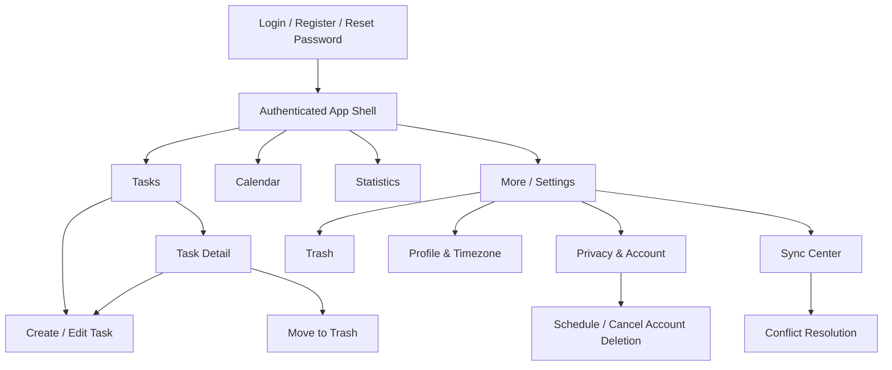

# UI Design — To-Do App Mahasiswa

Status: UI baseline untuk issue planning dan implementation
Tanggal: 29 Juni 2026
Input: `03-specification.md` (`DOC-003`), `04-prioritization.md` (`DOC-004`), dan `07-database-api-design.md` (`DOC-007`)
Platform: responsive web/PWA; personal account MVP

## 1. UX Goals and Boundaries

- Mahasiswa dapat mencatat, menemukan, memprioritaskan, menyelesaikan, dan memulihkan task dengan langkah minimum (`GOAL-001–003`).
- Offline bukan state error: task tetap dapat dibaca dan diubah, dengan status sync yang selalu terlihat (`REQ-017/018`, NFR-004/005).
- Tidak ada silent overwrite atau silent data loss. Pending, failed, dan conflict memiliki state serta tindakan eksplisit.
- UI memakai Bahasa Indonesia, timezone profil, dan format tanggal lokal; API tetap menyimpan UTC (`REQ-007/013`, `ADR-008`).
- Semua alur inti mendukung keyboard, accessible name, visible focus, contrast teks normal minimal 4.5:1, dan target sentuh minimal 44×44 px (`NFR-008`).
- Kanban, tag, subtugas, recurring task, reminder, export, kolaborasi, dan Android native tidak termasuk MVP.

## 2. Information Architecture



### Desktop Navigation

- Persistent sidebar: Tasks, Calendar, Statistics.
- Secondary section: Sync Center, Trash, Settings.
- Header: page title, global sync indicator, quick create button, profile menu.

### Mobile Navigation

- Bottom navigation: Tasks, Calendar, Statistics, More.
- Floating/primary `+ Task` action remains reachable above bottom navigation.
- More opens Sync Center, Trash, Profile, Privacy, and Logout.
- Navigation order and labels remain stable across orientations.

## 3. Screen List

| UI ID | Screen | User Goal | Main Actions | Data/API | Traceability |
|---|---|---|---|---|---|
| UI-001 | Login | Access private tasks | Login, open register/reset | API-002 | REQ-015; AC-016 |
| UI-002 | Register | Create account | Register with timezone/locale | API-001 | REQ-015; AC-016; NFR-006 |
| UI-003 | Reset Request | Request password recovery | Submit email, return login | API-004 | REQ-015; AC-016 |
| UI-004 | Reset Confirm | Set a new password | Submit token/new password | API-005 | REQ-015; AC-016 |
| UI-005 | App Shell | Navigate and know sync state | Navigate, quick create, profile/logout | API-003/006 | REQ-015/017/018; NFR-008 |
| UI-006 | Task List | Review and prioritize tasks | Filter, sort, create, open, complete/reopen | API-008/012/013 | REQ-002/004/006; AC-003/005/007 |
| UI-007 | Task Form | Create or edit a task | Enter fields, save locally/server | API-009/011 | REQ-001/003/007/017; AC-001/002/004/008/019 |
| UI-008 | Task Detail | Understand/manage one task | Edit, complete/reopen, trash | API-010–014 | REQ-002–005/007; AC-003–006/008 |
| UI-009 | Calendar | See workload by due date | Change month/date, open task | API-017 | REQ-013; AC-014 |
| UI-010 | Trash | Restore or permanently delete | Restore, permanent delete | API-008/015/016 | REQ-005/022; AC-006/025 |
| UI-011 | Completion Statistics | Review consistency | Select period, inspect count | API-018 | REQ-025; AC-028 |
| UI-012 | Sync Center | Understand pending/failed sync | Retry, inspect commands, open conflicts, snapshot reset | API-019–023 | REQ-017/018; AC-019/020; NFR-004/005 |
| UI-013 | Conflict Resolution | Resolve competing versions safely | Keep local/server or merge | API-024/025 | REQ-018; AC-021; NFR-005 |
| UI-014 | Profile & Preferences | Set correct timezone/locale | Update timezone/locale | API-006/007 | REQ-007/013; AC-008/014 |
| UI-015 | Privacy & Data Summary | Understand stored data/retention | View categories/counts/policies | API-026 | NFR-007 |
| UI-016 | Account Deletion | Schedule/cancel deletion safely | Reauthenticate, schedule/cancel | API-027/028 | REQ-024; AC-027 |
| UI-017 | Session/Error Recovery | Recover from auth/access failures | Login again, retry, return tasks | Common errors | AC-016/017; NFR-006 |

## 4. Route Map and Permissions

| Route | Screen | Access | Behavior |
|---|---|---|---|
| `/login` | UI-001 | Public | Authenticated user redirects to `/tasks`. |
| `/register` | UI-002 | Public | Authenticated user redirects to `/tasks`. |
| `/reset-password` | UI-003 | Public | Always shows generic completion response. |
| `/reset-password/confirm` | UI-004 | Public with token | Invalid/expired token shows safe retry path. |
| `/tasks` | UI-006 | Session | Default authenticated landing page. |
| `/tasks/new` | UI-007 | Session | Available offline after prior authenticated cache exists. |
| `/tasks/:taskId` | UI-008 | Session/owner | Unknown or cross-owner task renders the same not-found state. |
| `/tasks/:taskId/edit` | UI-007 | Session/owner | Uses local replica first, refreshes when online. |
| `/calendar` | UI-009 | Session | Uses profile timezone. |
| `/statistics` | UI-011 | Session | Date range maximum 366 days. |
| `/trash` | UI-010 | Session | Owner-only trashed tasks. |
| `/sync` | UI-012 | Session | Shows local queue even while offline. |
| `/sync/conflicts/:conflictId` | UI-013 | Session/owner | Cross-owner/missing uses not-found state. |
| `/settings/profile` | UI-014 | Session | Timezone/locale preferences. |
| `/settings/privacy` | UI-015 | Session | Data summary and account lifecycle entry. |
| `/settings/delete-account` | UI-016 | Session + recent reauth to submit | Pending-deletion state remains accessible. |

MVP has one role: authenticated task owner. No collaboration permission UI is rendered.

## 5. Primary User Flows

### UI-101 — Register and First Task

1. User opens UI-002, enters email, password, timezone, and locale.
2. Successful registration enters UI-005/UI-006.
3. Empty state explains the product and offers `Buat task pertama`.
4. UI-007 validates title locally and creates the task.
5. Online: show `Task dibuat`; offline: show task immediately with `Menunggu sinkronisasi`.

Links: REQ-001/015/017; AC-001/002/016/019; API-001/009.

### UI-102 — Review, Filter, and Complete

1. UI-006 opens active tasks sorted by due date nearest first.
2. User changes status/priority filter or sort; URL query/local state preserves selection.
3. User completes a task from row quick action or UI-008.
4. Task moves to completed view and receives canonical/pending sync state.
5. Undo action is available briefly and maps to reopen, without hiding the permanent completed view.

Links: REQ-002/004/006; AC-003/005/007; API-008/012/013.

### UI-103 — Create/Edit Offline and Reconnect

1. Global state changes to `Offline — perubahan disimpan di perangkat ini`.
2. UI-007 saves valid changes to IndexedDB and command queue.
3. Task/list/detail display a persistent `Menunggu sinkronisasi` badge.
4. On reconnect, UI-005 announces syncing without blocking normal work.
5. Success clears pending state; retryable failure keeps it pending; conflict routes to UI-013.

Links: REQ-008/017/018; AC-009/019/020/021; API-020–025.

### UI-104 — Trash, Restore, and Permanent Delete

1. UI-008 `Pindahkan ke Trash` opens a confirmation dialog.
2. Confirmed task disappears from active/completed and appears in UI-010 with deletion date and days remaining.
3. Restore returns it to its previous active/completed status.
4. Permanent delete requires recent reauth and typed confirmation `HAPUS PERMANEN`.
5. Expired retention displays `Masa pemulihan berakhir` and removes restore action.

Links: REQ-005/022; AC-006/025; API-014–016.

### UI-105 — Resolve Sync Conflict

1. UI-012 lists conflict count and affected tasks without auto-selecting a winner.
2. UI-013 shows local proposal and server version side by side, field by field.
3. User chooses `Gunakan versi perangkat`, `Gunakan versi server`, or edits a merged result.
4. Confirmation summarizes the selected result before submit.
5. If server changes again, keep both versions and refresh the comparison; never discard the user selection silently.

Links: REQ-018; AC-021; API-023–025.

### UI-106 — Schedule or Cancel Account Deletion

1. UI-015 links to UI-016 with explanation of 30-day grace period.
2. User reauthenticates, types `HAPUS AKUN`, and confirms.
3. UI-005 shows a persistent banner with exact deletion deadline and `Batalkan penghapusan`.
4. Cancel removes the schedule after confirmation.
5. If irreversible deletion has begun, UI displays the safe final state from API-028.

Links: REQ-024; AC-027; API-026–028.

## 6. Screen Specifications

### UI-001 to UI-004 — Authentication

- Single-column card, max readable width 440 px; product value statement remains brief.
- Password input includes show/hide control with accessible label; paste is allowed.
- Login failure message: `Email atau kata sandi tidak cocok.` Never identify which field/account failed.
- Reset request success: `Jika email terdaftar, petunjuk reset akan dikirim.`
- Submit button shows progress and prevents duplicate submission while request is in flight.
- Network error preserves non-secret fields; password values are cleared after failed server authentication.

### UI-005 — App Shell and Global Sync Indicator

- Skip link targets main content.
- Page heading changes per route and is the first logical heading.
- Sync indicator is a button linking to UI-012 and has text, icon, and accessible status—not color only.
- Status transitions use `aria-live="polite"`; repeated background changes are debounced to avoid screen-reader noise.
- Account-deletion banner has higher visual priority than sync success but does not cover navigation.

### UI-006 — Task List

- Default segment: Active; secondary segments: Completed. Trash is navigated separately.
- Task row/card displays title, priority, due date/time, status, and sync badge. Description stays in detail to reduce noise.
- Primary page action: `Buat task`; row actions: complete/reopen and overflow menu.
- Filter controls: status segment, priority, due range; sort: due date, priority, created, updated.
- Filter summary is removable one item at a time and has `Hapus semua filter`.
- Virtualization is optional only if it preserves keyboard/focus behavior; pagination/local query must meet NFR-002.

### UI-007 — Task Form

- Mobile: full-page form; desktop: route-backed side panel or page so browser Back works reliably.
- Fields: title, description, priority, due date, optional due time, timezone display.
- Primary action: `Simpan task`; secondary: `Batal`.
- Unsaved local edits trigger a navigation warning; once written to IndexedDB they are considered saved locally even if pending server sync.
- Edit screen shows current version only as internal state, never as a user-editable field.

### UI-008 — Task Detail

- Displays title, description, status, priority, local due time/timezone, last update, and sync state.
- Primary context action is complete or reopen; edit remains prominent; trash is in destructive section/overflow.
- Server/client version numbers are hidden unless conflict diagnostics are needed.
- A not-found response does not reveal whether another user owns the identifier.

### UI-009 — Calendar

- Month view plus accessible agenda/list view. Keyboard users can switch date cells and open task details.
- Each date announces date and task count. Tasks use title plus priority text/icon, not color alone.
- Today and selected date are visually and semantically distinct.
- Empty selected date says `Tidak ada task bertenggat pada tanggal ini` with `Buat task` action pre-filling the selected date.

### UI-010 — Trash

- Shows deleted date and `Dapat dipulihkan sampai <date>`.
- Default sorting: earliest expiry first.
- Restore is the primary action; permanent delete uses danger styling and separate confirmation.
- Items pending offline deletion/restore display that state and cannot be purged until server confirmation.

### UI-011 — Completion Statistics

- Displays one primary metric: `Task selesai` and selected period.
- Presets: 7 days, 30 days, current semester/custom (custom max 366 days).
- Clarifying copy: a task is counted once per selected period.
- No claim that completion count causes academic score improvement.

### UI-012 — Sync Center

- Sections: status summary, pending commands, failed commands, conflicts, device/client information.
- `Coba lagi` is available for retryable failures; permanent failures link to edit/recovery guidance.
- Snapshot reset explanation states that pending local changes will be preserved.
- Diagnostic copy may show command time/type but never password, token, or full task content in generic logs.

### UI-013 — Conflict Resolution

- Two-column comparison on desktop; stacked labeled cards on mobile.
- Changed fields are highlighted with text labels `Versi perangkat` and `Versi server`.
- Merge form uses the same validation as UI-007.
- Closing without resolution keeps the conflict open and both versions retained.

### UI-014 to UI-016 — Settings and Privacy

- Profile timezone selection uses searchable IANA-friendly city labels while submitting canonical timezone IDs.
- Changing timezone previews how one upcoming due date will display.
- Privacy summary groups profile, tasks, sync/device data, and retention without showing internal security metadata.
- Account deletion separates explanation, reauthentication, typed confirmation, and final confirmation into clear steps.

## 7. Form Specifications

| UI/Form | Field | Control | Validation | Message | API |
|---|---|---|---|---|---|
| UI-001 Login | Email | Email input | required, valid format, max 254 | `Masukkan email yang valid.` | API-002 |
| UI-001 Login | Password | Password input | required | `Masukkan kata sandi.` | API-002 |
| UI-002 Register | Email | Email input | required, normalized, max 254 | `Masukkan email yang valid.` | API-001 |
| UI-002 Register | Password | Password input | minimum 12 chars | `Gunakan minimal 12 karakter.` | API-001 |
| UI-002 Register | Timezone | Combobox | valid IANA timezone | `Pilih zona waktu.` | API-001 |
| UI-002 Register | Locale | Select | supported locale; default id-ID | `Pilih bahasa dan format.` | API-001 |
| UI-004 Reset | Token | Hidden/from link | required, valid/unused/unexpired | `Tautan reset tidak valid atau kedaluwarsa.` | API-005 |
| UI-004 Reset | New password | Password input | minimum 12 chars | `Gunakan minimal 12 karakter.` | API-005 |
| UI-007 Task | Title | Text input | trimmed 1–200 chars | `Judul task wajib diisi.` / `Maksimal 200 karakter.` | API-009/011 |
| UI-007 Task | Description | Textarea | optional, max 5,000 | `Deskripsi maksimal 5.000 karakter.` | API-009/011 |
| UI-007 Task | Priority | Select/radio | none, low, medium, high | `Pilih prioritas yang valid.` | API-009/011 |
| UI-007 Task | Due date | Date input | optional; required when due time used | `Pilih tanggal tenggat.` | API-009/011 |
| UI-007 Task | Due time | Time input | optional; defaults 23:59 | `Masukkan waktu yang valid.` | API-009/011 |
| UI-007 Task | Timezone | Read-only + settings link | valid profile zone | `Perbarui zona waktu di Pengaturan.` | API-007/009/011 |
| UI-013 Conflict | Resolution | Radio | keep_local, keep_server, merged | `Pilih cara menyelesaikan konflik.` | API-025 |
| UI-013 Conflict | Merged task | Task form | same as UI-007 | Same field messages | API-025 |
| UI-014 Profile | Timezone | Combobox | valid IANA timezone | `Pilih zona waktu yang valid.` | API-007 |
| UI-014 Profile | Locale | Select | supported BCP47 option | `Pilih format bahasa.` | API-007 |
| UI-016 Delete account | Password/reauth | Password input | required, recent reauth | `Konfirmasi identitas Anda.` | API-027 |
| UI-016 Delete account | Confirmation | Text input | exact `HAPUS AKUN` | `Ketik HAPUS AKUN untuk melanjutkan.` | API-027 |
| UI-010 Permanent delete | Confirmation | Text input | exact `HAPUS PERMANEN` | `Ketik HAPUS PERMANEN.` | API-016 |

Client validation improves feedback but never replaces server validation. API `fieldErrors` map to the matching field and focus moves to the first invalid field after submit.

## 8. Major UI States

| UI ID | State | Presentation | Required Action/Behavior | Traceability |
|---|---|---|---|---|
| UI-201 | Initial loading | Route skeleton with stable layout and text label for assistive tech | Do not show empty state prematurely | NFR-001/002/008 |
| UI-202 | Empty task list | `Belum ada task aktif` + Create action | Keep filters visible; distinguish filtered empty | REQ-001/002 |
| UI-203 | Offline | Persistent banner/indicator: `Offline — perubahan disimpan di perangkat ini` | Core task actions remain enabled; server-only actions explain limitation | REQ-017; AC-019 |
| UI-204 | Syncing/pending | Per-task badge and global count | Do not block navigation; queue persists | REQ-018; AC-020 |
| UI-205 | Sync failed | Retryable/permanent labels with reason and action | Preserve local task/command; retry with backoff | NFR-004/005; API errors |
| UI-206 | Conflict | High-attention non-destructive badge | Open UI-013; retain both versions | REQ-018; AC-021 |
| UI-207 | Session expired | Modal/page preserving safe return path | Clear secret state, login again; never delete pending queue silently | REQ-015/017; NFR-006 |
| UI-208 | Unauthorized/not found | Same neutral not-found content for absent/cross-owner resource | Return Tasks; no ownership disclosure | AC-017; API 404 |
| UI-209 | Account deletion pending | Persistent dated banner | Cancel action available until API says irreversible | REQ-024; AC-027 |
| UI-210 | Service unavailable | Cached content remains; server-only action queues or explains unavailability | Retry/backoff; correlation ID in details | API 503; NFR-004 |

### Per-Screen Loading, Empty, Error, and Success

| Screen | Loading | Empty | Error | Success |
|---|---|---|---|---|
| UI-001–004 Auth | Button progress; form remains stable | Not applicable | Inline generic auth/reset error | Redirect or generic reset confirmation |
| UI-006 Task List | List skeleton on first load; cached list immediately when available | First-task CTA or `Tidak ada hasil untuk filter ini` | Cached data + retry banner; filters preserved | Updated row plus concise toast |
| UI-007 Task Form | Save button progress | New form defaults | Field errors; safe input preserved | Return/detail with synced or pending badge |
| UI-008 Task Detail | Detail skeleton or cached detail | Not found uses UI-208 | Retry while preserving cached content | Canonical/pending task state |
| UI-009 Calendar | Calendar shell + date skeleton | No due tasks for selected date | Cached month + retry | Selected month/date and task count |
| UI-010 Trash | List skeleton/cached trash | `Trash kosong` | Retry without hiding expiry information | Restore/delete confirmation and updated list |
| UI-011 Statistics | Metric skeleton | Count `0`, not an error | Retry; selected period preserved | Count and period label |
| UI-012 Sync Center | Local queue immediately; server section loading | `Semua perubahan sudah tersinkron` | Retryable/permanent sections remain actionable | Queue count reaches zero/acknowledged |
| UI-013 Conflict | Comparison skeleton after local summary | Resolved/removed conflict returns to Sync Center | New-version conflict refreshes both versions | Resolution confirmation + canonical task |
| UI-015/016 Privacy | Summary/action progress | Zero counts displayed explicitly | Safe error + correlation; destructive input preserved only when appropriate | Exact schedule/cancellation state |

### State Priority

1. Destructive/account lifecycle warning.
2. Conflict or permanent sync failure.
3. Offline/pending sync.
4. Informational success.

Multiple states may coexist; the UI must not replace a conflict warning with a short-lived success toast.

## 9. Feedback and Messages

- Success toast examples: `Task dibuat`, `Perubahan disimpan`, `Task dipulihkan`.
- Offline success: `Disimpan di perangkat ini. Akan disinkronkan saat online.`
- Conflict: `Task berubah di perangkat lain. Pilih versi yang ingin disimpan.`
- Retryable error: `Belum dapat disinkronkan. Perubahan tetap aman di perangkat ini.`
- Generic server error: `Terjadi kesalahan. Coba lagi.` with expandable correlation ID.
- Rate limit: `Terlalu banyak percobaan. Coba lagi dalam <duration>.`
- Permanent delete/account delete messages state exact consequences and deadline; euphemisms such as `hapus saja` are avoided.
- Toasts never contain passwords, reset tokens, task descriptions, or private content unnecessary for feedback.

## 10. Wireframes

### Desktop Task List

```text
┌──────────────┬──────────────────────────────────────────────────────────┐
│  To-Do      │ Tasks                         [✓ Tersinkron] [+ Buat task]│
│             ├──────────────────────────────────────────────────────────┤
│ • Tasks     │ [Aktif] [Selesai]   Prioritas [Semua▼]  Urut [Tenggat▼] │
│ • Calendar  ├──────────────────────────────────────────────────────────┤
│ • Statistics│ □ Tugas Basis Data              High   Besok, 23:59  ⋮  │
│             │   [Menunggu sinkronisasi]                               │
│ • Sync      │ □ Presentasi Kelompok           Medium Jum, 14:00   ⋮  │
│ • Trash     │ □ Baca jurnal                    —      Tanpa tenggat ⋮  │
│ • Settings  │                                                          │
└──────────────┴──────────────────────────────────────────────────────────┘
```

### Mobile Task List

```text
┌──────────────────────────────┐
│ Tasks        [Offline]    (+)│
│ [Aktif] [Selesai]            │
│ [Filter 1] [Urut: Tenggat]   │
├──────────────────────────────┤
│ Tugas Basis Data             │
│ High • Besok 23:59           │
│ Menunggu sinkronisasi    [✓] │
├──────────────────────────────┤
│ Presentasi Kelompok          │
│ Medium • Jumat 14:00     [✓] │
├──────────────────────────────┤
│ Tasks Calendar Stats More    │
└──────────────────────────────┘
```

### Task Form

```text
┌──────────────────────────────────────────┐
│ Buat task                           [X]  │
│ Judul *  [___________________________]  │
│ Deskripsi [__________________________]  │
│           [__________________________]  │
│ Prioritas [Tidak ada ▼]                 │
│ Tenggat   [Tanggal] [Waktu opsional]    │
│ Zona waktu: Australia/Perth [Ubah]      │
│                                          │
│ [Batal]                    [Simpan task] │
└──────────────────────────────────────────┘
```

### Conflict Resolution

```text
┌─────────────────────────────────────────────────────────────┐
│ Selesaikan konflik                                          │
│ Task berubah di perangkat lain. Tidak ada versi yang dibuang.│
├────────────────────────────┬────────────────────────────────┤
│ Versi perangkat            │ Versi server                  │
│ Judul: Tugas revisi        │ Judul: Tugas Basis Data       │
│ Due: Jumat 23:59           │ Due: Kamis 23:59              │
│ [Gunakan versi ini]        │ [Gunakan versi ini]           │
├────────────────────────────┴────────────────────────────────┤
│ [Gabungkan dan edit]                       [Simpan pilihan] │
└─────────────────────────────────────────────────────────────┘
```

## 11. Responsive Behavior

| Width | Layout |
|---|---|
| `<768px` | Bottom nav, single-column pages, full-screen task form, stacked conflict cards, compact task cards. |
| `768–1023px` | Collapsible navigation rail, list/detail routes remain separate, two-column calendar where space allows. |
| `>=1024px` | Persistent sidebar, wider list, optional route-backed side panel for create/edit, side-by-side conflict comparison. |

- No horizontal scrolling for core forms at 320 CSS px width.
- Browser zoom 200% preserves content/action access.
- Orientation changes do not reset form/filter/sync state.
- Safe-area insets are respected for PWA bottom navigation and floating action.

## 12. Accessibility Requirements

- One visible `h1` per route; logical heading order.
- Every input has persistent label, help/error association, and required indication in text.
- Keyboard focus order follows visual/logical order; dialogs trap focus and restore it to the opener.
- Escape closes non-destructive dialog; destructive confirmation never triggers from Escape/Enter accidentally.
- Icon-only buttons have accessible names and tooltips; semantic buttons/links are used instead of clickable divs.
- Priority, task status, sync status, and conflict state use text/icon in addition to color.
- Calendar supplies agenda/list alternative and announces date/task count.
- Status messages use appropriate live regions; validation summary receives focus after failed submit.
- Respect `prefers-reduced-motion`; no essential information depends on animation.
- Minimum pointer target 44×44 px; visible focus contrast is distinguishable from component boundary.

## 13. Component Inventory

| Component | Variants/States | Used By |
|---|---|---|
| AppShell | desktop sidebar, tablet rail, mobile bottom nav | UI-005–016 |
| SyncIndicator | synced, offline, syncing, failed, conflict | UI-005/006/008/012 |
| TaskCard/Row | active, completed, trashed, pending, failed, conflict | UI-006/009/010 |
| TaskForm | create, edit, merge; pristine/dirty/saving/error | UI-007/013 |
| FilterBar | default, active filters, filtered empty | UI-006 |
| Calendar/Agenda | month, selected date, today, empty | UI-009 |
| ConfirmationDialog | soft delete, restore, permanent delete, logout with pending commands | UI-008/010/005 |
| StatusBanner | offline, account deletion, service unavailable | UI-005 |
| EmptyState | first task, filtered empty, no completed tasks, empty trash/conflicts | UI-006/010/012 |
| ErrorSummary | validation, API, retryable, permanent | All forms |
| Toast | success, informational; never critical-only | App shell |

## 14. API Error-to-UI Mapping

| API Code | UI Behavior |
|---|---|
| `MALFORMED_REQUEST` | Generic form/request error; retain safe input. |
| `AUTH_REQUIRED` / `INVALID_CREDENTIALS` | Login error or UI-207; do not identify account existence. |
| `CSRF_FAILED` | Refresh security context once; if still failing, require login. |
| `NOT_FOUND` | UI-208 neutral not-found state. |
| `VERSION_CONFLICT` | Mark task conflict and open/link UI-013. |
| `IDEMPOTENCY_KEY_REUSED` | Do not auto-generate for same logical action; show recovery and log correlation. |
| `SYNC_RESET_REQUIRED` | Explain snapshot reset; preserve DATA-014 pending commands. |
| `RETENTION_EXPIRED` | Disable restore and explain expiration. |
| `COMMAND_EXPIRED` | Mark permanent sync failure and offer manual copy/edit recovery. |
| `PAYLOAD_TOO_LARGE` | Keep form/queue data and explain which limit was exceeded. |
| `VALIDATION_ERROR` | Map field errors, focus first invalid field. |
| `RATE_LIMITED` | Disable retry until `Retry-After`; show countdown text. |
| `INTERNAL_ERROR` | Safe message + correlation ID; preserve local data. |
| `SERVICE_UNAVAILABLE` | Enter UI-210; queue supported task mutations or retry server-only action. |

## 15. UI Traceability Matrix

| Requirement / AC | UI IDs | API IDs | Verification Focus |
|---|---|---|---|
| REQ-001; AC-001/002 | UI-006/007/101 | API-009 | Valid/blank title; optimistic/offline create. |
| REQ-002; AC-003 | UI-006/008/010 | API-008/010 | Active/completed/trashed ownership views. |
| REQ-003; AC-004 | UI-007/008 | API-011 | Edit without duplicate and preserve fields. |
| REQ-004; AC-005 | UI-006/008/102 | API-012, API-013 | Complete/reopen and status movement. |
| REQ-005; AC-006 | UI-008/010/104 | API-014/016 | Confirmed soft/permanent deletion. |
| REQ-006; AC-007 | UI-006 | API-008 | Filter/sort and filtered-empty state. |
| REQ-007; AC-008 | UI-007/014 | API-007/009/011 | Priority, due default 23:59, timezone. |
| REQ-008; AC-009 | UI-005–008/012 | Local store + API-022 | Restart/reload persistence. |
| REQ-013; AC-014 | UI-009 | API-017 | Correct local date and accessible calendar. |
| REQ-015; AC-016/017 | UI-001–005/017 | API-001–006 | Auth paths and neutral isolation error. |
| REQ-017; AC-019 | UI-005–008/012/203 | API-019/020 | Offline operations and pending state. |
| REQ-018; AC-020/021 | UI-012/013/103/105/204–206 | API-020, API-021, API-022, API-023, API-024, API-025 | Replay, acknowledgement, no silent overwrite. |
| REQ-022; AC-025 | UI-010/104 | API-015 | Restore before expiry and expired state. |
| REQ-024; AC-027 | UI-015/016/106/209 | API-026–028 | Exact deadline and cancellation. |
| REQ-025; AC-028 | UI-011 | API-018 | Distinct count and period boundaries. |
| NFR-001/002/008 | All core screens | API list/query endpoints | Usability, performance perception, accessibility. |

## 16. Risks and Validation Notes

| Risk | UI Mitigation | Validation |
|---|---|---|
| Students misunderstand sync badges | Consistent text labels and Sync Center explanation | Usability test with minimal 5 students (`VAL-016`, `DEC-025`) |
| Conflict flow is cognitively heavy | Field-level compare, plain-language choices, no default winner | Scenario test with two-device edits |
| Mobile calendar is cramped | Agenda alternative and date-focused view | 320 px, zoom 200%, keyboard/screen-reader test |
| Offline logout could hide pending work | Explicit warning and non-destructive local retention | Restart/logout integration test |
| Destructive actions are mistaken | Separate danger zone, reauth, typed confirmation | Manual destructive-flow test |
| Account deletion banner causes panic | Exact date, concise explanation, clear cancel action | Content/usability review |

No API gap blocks the committed MVP UI. Provider-specific password/email behavior and final visual brand are implementation/configuration decisions, not new product scope.

## 17. Handoff to `09-se-issue-planning`

Create implementation issues grouped by:

1. App shell, responsive navigation, accessibility foundation, and global state handling.
2. Authentication/profile screens UI-001–005/014.
3. Task list/form/detail/calendar/trash/statistics UI-006–011.
4. IndexedDB queue, sync indicator/center, and snapshot recovery UI-012/UI-203–205.
5. Conflict comparison/resolution UI-013/UI-105/UI-206.
6. Privacy/account deletion UI-015/016/UI-106/UI-209.
7. Automated component/integration accessibility tests and manual usability scenarios.

Each issue must preserve UI, REQ, AC, and API IDs and include responsive, loading, empty, error, offline, and accessibility acceptance checks.
